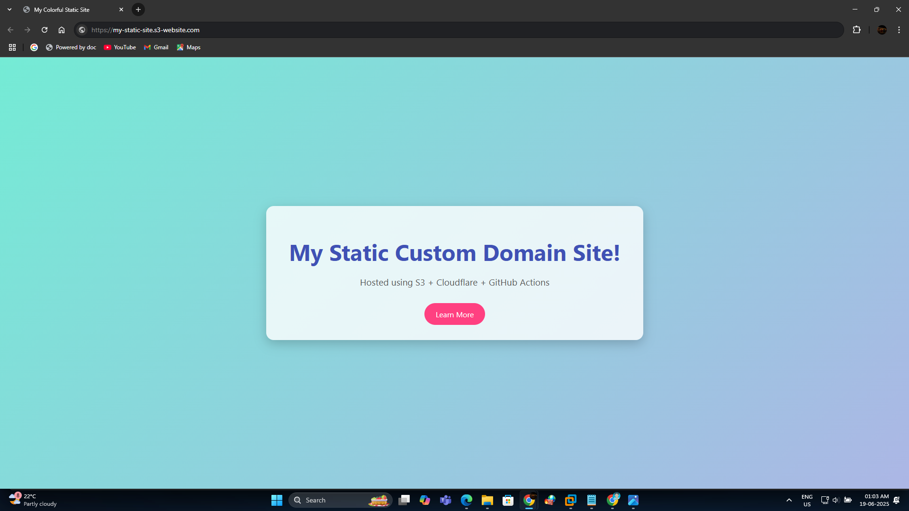

# 🌐 Static Website Hosting with S3 + CloudFront + GitHub Actions

This project demonstrates how to host a static website using **AWS S3** for storage, **CloudFront** for HTTPS and CDN, and **GitHub Actions** for fully automated deployment.

---
---

## 📖 Project Blog

Read the full story behind this project on Medium: [Building an Open Source Incident Management System with Flask, SQLite, Docker & Email Alerts](https://medium.com/@vibhavakrishna999/host-a-static-website-with-s3-cloudfront-github-actions-free-scalable-secure-32ad401df975)


---

## 🚀 Stack

- **Amazon S3** – static website hosting
- **Amazon CloudFront** – CDN distribution + HTTPS
- **GitHub Actions** – CI/CD deployment pipeline
- **HTML/CSS** – static site files

---

---

## ⚙️ Setup Instructions

1. **Create an S3 Bucket**
   - Enable static website hosting
   - Set public read permissions (or use OAI if using private access via CloudFront)

2. **Set Up CloudFront**
   - Use your S3 bucket as the origin
   - Configure HTTPS (via AWS Certificate Manager)
   - Set a custom domain (optional)

3. **Configure GitHub Actions**
   - Store AWS credentials in GitHub Secrets:
     - `AWS_ACCESS_KEY_ID`
     - `AWS_SECRET_ACCESS_KEY`
   - Define your `bucket-name` and `distribution-id` in the workflow file

4. **Push to GitHub**
   - Trigger the GitHub Action on push to deploy automatically

---

## 🔁 Deployment Workflow

Below is the high-level workflow of the deployment process:

### 📊 Workflow Diagram

> 🖼️ **Add your workflow screenshot here**  
> _Replace the example below with your own screenshot._


```text
+-------------------+
|   GitHub Repo     |
| (HTML/CSS Files)  |
+--------+----------+
         |
         v
+-------------------+
| GitHub Actions CI |
| (.yml Workflow)   |
+--------+----------+
         |
         v
+-------------------+
|    AWS S3 Bucket  |
| (Static Website)  |
+--------+----------+
         |
         v
+-------------------+
|   CloudFront CDN  |
|  (HTTPS + Cache)  |
+--------+----------+
         |
         v
+-------------------+
|  https://example.com |
+-------------------+


